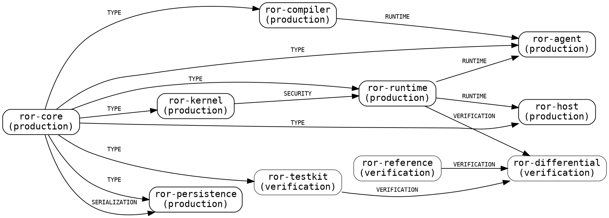

# dep/01 — Dependency Graph

GENERATED by `python3 dep/_graph.py --write` — do not edit; edit `dep/_edges.py` and re-run. Convention: **`A -> B` means B depends on A** (the arrow points from the thing depended upon to the thing that depends on it), matching `spec/04`. `mod/18` uses the opposite convention — see `dep/05` V-06.

## 0. Summary

| Layer | Nodes | Edges | TYPE_DEPENDENCY | SEMANTIC_DEPENDENCY | SECURITY_DEPENDENCY | SERIALIZATION_DEPENDENCY | PERSISTENCE_DEPENDENCY | VERIFICATION_DEPENDENCY | RUNTIME_DEPENDENCY |
|---|---|---|---|---|---|---|---|---|---|
| crate | 10 | 15 | 7 | 0 | 1 | 1 | 0 | 3 | 3 |
| module | 17 | 137 | 20 | 28 | 7 | 4 | 10 | 49 | 19 |
| requirement | 545 | 927 | 72 | 214 | 82 | 71 | 75 | 247 | 166 |
| section | 24 | 34 | 4 | 5 | 7 | 2 | 3 | 6 | 7 |

Roots/leaves per layer: §1.4 (crate), §2.8 (module), §3.3 (requirement), §4 (section). Orderings in `dep/02`; cycles in `dep/03`; the cross-section table in `dep/04`; violations in `dep/05`.

---

## 1. Layer 1 — crate graph (10 crates)

Edges are the frozen crate direction (`spec/07` §6, restated from R-REPO-02/R-ARCH-04 and `Red-on-Rust.md` L39196-40762 §2-§12). Parallel edges of different kinds between the same pair are kept: `ror-persistence` depends on `ror-core` both for types and for the 15A byte format.

| `A -> B` (B depends on A) | Kind | Visibility | Basis / evidence |
|---|---|---|---|
| `ror-core -> ror-compiler` | TYPE_DEPENDENCY | spec/07 §6 | spec/07 §6 `ror-compiler -> ror-core`; REQ-REPO-006/008 |
| `ror-core -> ror-kernel` | TYPE_DEPENDENCY | spec/07 §6 | spec/07 §6 `ror-kernel -> ror-core`; REQ-REPO-006/009 |
| `ror-core -> ror-runtime` | TYPE_DEPENDENCY | spec/07 §6 | spec/07 §6 `ror-runtime -> ror-core, ror-kernel` |
| `ror-kernel -> ror-runtime` | SECURITY_DEPENDENCY | spec/07 §6 | L39455 'The evaluator may depend on kernel interfaces but must not gain authority introspection'; R-TRUST-03; MODULE_DEPS MOD-05->MOD-03 |
| `ror-core -> ror-persistence` | TYPE_DEPENDENCY | spec/07 §6 | spec/07 §6 `ror-persistence -> ror-core` |
| `ror-core -> ror-persistence` | SERIALIZATION_DEPENDENCY | spec/07 §6 | 15B payloads are strictly 15A bytes (R-PERSIST-01/02); 15A lives in ror-core (R-CANON-01…11) — mod/11-persistence.md DEPENDENCIES |
| `ror-core -> ror-host` | TYPE_DEPENDENCY | spec/07 §6 | spec/07 §6 `ror-host -> ror-core, ror-runtime` |
| `ror-runtime -> ror-host` | RUNTIME_DEPENDENCY | spec/07 §6 | spec/07 §6 adapter boundary; L39508 §8 `ror-host` (HostExecutor + live host adapter interfaces); MODULE_DEPS MOD-09->MOD-08 |
| `ror-core -> ror-agent` | TYPE_DEPENDENCY | spec/07 §6 | spec/07 §6 `ror-agent -> ror-core, ror-compiler, ror-runtime` |
| `ror-compiler -> ror-agent` | RUNTIME_DEPENDENCY | spec/07 §6 | spec/07 §6; R-PLANNER-02 (proposals must pass the compiler) |
| `ror-runtime -> ror-agent` | RUNTIME_DEPENDENCY | spec/07 §6 | spec/07 §6; REQ-ARCH-001 stage order (planner -> machine boundary) |
| `ror-core -> ror-testkit` | TYPE_DEPENDENCY | spec/07 §6 | spec/07 §6 `ror-testkit -> ror-core (+ test-only deps)` |
| `ror-reference -> ror-differential` | VERIFICATION_DEPENDENCY | spec/07 §6 | spec/07 §6 `ror-differential -> ror-reference, ...`; R-REF-05 comparator |
| `ror-runtime -> ror-differential` | VERIFICATION_DEPENDENCY | spec/07 §6 | spec/07 §6 'ror-runtime (black box)' — SUT observation edge, not a semantic dependency |
| `ror-testkit -> ror-differential` | VERIFICATION_DEPENDENCY | spec/07 §6 | spec/07 §6 `ror-differential -> ... ror-testkit`; R-REF-06 doubles |

### 1.1 Forbidden edges (frozen; none may appear above)

| Dependent | MUST NOT depend on | Source | Present? |
|---|---|---|---|
| `ror-reference` | `ror-runtime` | L39815 §14 FORBIDDEN; L39645-39651 §10 | no |
| `ror-reference` | `ror-kernel` | L39816 §14 FORBIDDEN; L39645-39651 §10 | no |
| `ror-reference` | `ror-persistence` | L39817 §14 FORBIDDEN; L39645-39651 §10 | no |
| `ror-reference` | `ror-host` | L39818 §14 FORBIDDEN; L39645-39651 §10 | no |
| `ror-reference` | `ror-agent` | L39645-39651 §10 (absent from the §14 list) | no |
| `ror-core` | `ror-runtime` | L39820 §14 FORBIDDEN | no |
| `ror-core` | `ror-kernel` | L39821 §14 FORBIDDEN | no |
| `ror-runtime` | `ror-reference` | L39823 §14 FORBIDDEN | no |
| `ror-kernel` | `ror-runtime` | L39824 §14 FORBIDDEN | no |
| `ror-compiler` | `ror-runtime` | L39826 §14 FORBIDDEN | no |

### 1.2 Required edges absent from every crate list

| `A -> B` (B depends on A) | Kind | Why the specification forces it |
|---|---|---|
| `ror-compiler -> ror-runtime` | TYPE_DEPENDENCY | REQ-ARCH-004/005 + L39962-39998 §17: `fn execute(plan: &ExecutablePlan)` with construction `pub(crate)`-restricted to the compiler (L39947-39950). The runtime must name `ExecutablePlan`, so either the type is exported from `ror-compiler` (this edge) or it lives in `ror-core` behind a seal. Neither `spec/07` §6 nor `spec/10-index.json` states which. |
| `ror-persistence -> ror-agent` | PERSISTENCE_DEPENDENCY | mod/13-agent.md DEPENDENCIES 'MOD-11 (durable recording)': `PlannerAccepted` recording for exact replay (R-PLANNER-04, REQ-PLANNER-018). `ror-agent -> ror-persistence` appears in no crate list. |
| `ror-persistence -> ror-runtime` | PERSISTENCE_DEPENDENCY | `mod/_ownership.MODULE_DEPS` labels `MOD-08 -> MOD-11` a **crate** dependency ('request step 14 calls ror-persistence append/sync'), and R-DUR-02 / `spec/07` §3 make that call the hinge of the durability transaction — no effect before the journal is durable. `spec/07` §6 gives `ror-runtime -> ror-core, ror-kernel` only, and `spec/10-index.json` agrees with §6 here, so the edge exists nowhere. Either add it, or state the journal-trait inversion (`ror-runtime` owns the trait, `ror-persistence` implements it, which flips the edge to `ror-runtime -> ror-persistence`). See V-10. |
| `ror-host -> ror-agent` | RUNTIME_DEPENDENCY | mod/13-agent.md DEPENDENCIES 'MOD-09 (replay composition for the conformance suite)'; mod/09-host.md DEPENDENCIES 'MOD-13 (end-to-end replay composition)'. Direction undecided — see V-04. |

**Adding all 4 keeps the crate layer acyclic** (19 edges, 0 non-trivial SCCs). The dependency levels of `dep/02` §1 change for `ror-agent` (level 3 -> 4) — `ror-agent` drops below `ror-host` only because of the replay-composition edge whose direction is undecided (V-04); the other three gaps cost nothing. Every gap in this section is therefore cheap to close: none of them introduces a cycle, and none forces a workspace re-ordering beyond the one undecided edge.

### 1.3 Picture (graphviz, generated from the table above)

Arrows point to the dependent, exactly as in the table and in `spec/04`'s DOT block. Parallel edges of different kinds are separate arrows.

### 1.4 Structural facts

- roots (depend on nothing): `ror-core`, `ror-reference`
- leaves (nothing depends on them): `ror-persistence`, `ror-host`, `ror-agent`, `ror-differential`
- SCCs: 10 (all trivial — the crate graph is acyclic)

### 1.5 `spec/10-index.json` disagreement

| Crate | `spec/07` §6 / this table | `spec/10-index.json` `depends_on` |
|---|---|---|
| `ror-core` | — | — |
| `ror-compiler` | `ror-core` | `ror-core` |
| `ror-kernel` | `ror-core` | `ror-core` |
| `ror-runtime` | `ror-core`, `ror-kernel` | `ror-core`, `ror-kernel` |
| `ror-persistence` | `ror-core` | `ror-core` |
| `ror-host` | `ror-core`, `ror-runtime` | `ror-core` **≠** |
| `ror-agent` | `ror-compiler`, `ror-core`, `ror-runtime` | `ror-core`, `ror-compiler`, `ror-runtime` |
| `ror-reference` | — | `frozen semantics only (no production core deps)` |
| `ror-differential` | `ror-reference`, `ror-runtime`, `ror-testkit` | `ror-reference`, `ror-runtime (black box)`, `ror-testkit` **≠** |
| `ror-testkit` | `ror-core` | `ror-core` |

See `dep/05` V-05 (and ID-4 for the non-crate entries).

---

## 2. Layer 2 — module graph (17 modules)

137 edges over 17 nodes. Visibility: `crate-table` = present in `mod/_ownership.py` MODULE_DEPS; `prose` = declared in the module file's DEPENDENCIES; `N req` = witnessed by N `req/` record pairs.

### 2.1 `TYPE_DEPENDENCY` (20 edges)

_The consumer names types/constructors declared by the provider._ Provider constraint: a production module that declares the type — `ror-core` domain types (MOD-01/MOD-04/MOD-10) and the plan-input, capability-ceiling and durable-state shapes (MOD-02/MOD-03/MOD-06/MOD-07); no MOD-14…MOD-17 module supplies a production type. Implementable: yes.

Check 11 verifies that constraint against all 20 edges below.

| `A -> B` (B depends on A) | Rule | Visibility | Why |
|---|---|---|---|
| `MOD-01 CORE -> MOD-02 COMPILER` | R14-domain-types | crate-table+prose+6 req | frozen semantic domain types and identifiers (R-CALC-*, R-CORE-*, REQ-REPO-006: `ror-core` is std-only) |
| `MOD-01 CORE -> MOD-03 CAPABILITY` | R14-domain-types | crate-table+prose+11 req | frozen semantic domain types and identifiers (R-CALC-*, R-CORE-*, REQ-REPO-006: `ror-core` is std-only) |
| `MOD-01 CORE -> MOD-04 BUDGET` | R14-domain-types | prose+4 req | frozen semantic domain types and identifiers (R-CALC-*, R-CORE-*, REQ-REPO-006: `ror-core` is std-only) |
| `MOD-01 CORE -> MOD-05 EVALUATOR` | R14-domain-types | crate-table+prose+2 req | frozen semantic domain types and identifiers (R-CALC-*, R-CORE-*, REQ-REPO-006: `ror-core` is std-only) |
| `MOD-01 CORE -> MOD-06 ACTOR` | R14-domain-types | crate-table+prose+5 req | frozen semantic domain types and identifiers (R-CALC-*, R-CORE-*, REQ-REPO-006: `ror-core` is std-only) |
| `MOD-01 CORE -> MOD-07 SCHEDULER` | R14-domain-types | crate-table+prose+2 req | frozen semantic domain types and identifiers (R-CALC-*, R-CORE-*, REQ-REPO-006: `ror-core` is std-only) |
| `MOD-01 CORE -> MOD-08 EFFECT` | R14-domain-types | crate-table+prose+7 req | frozen semantic domain types and identifiers (R-CALC-*, R-CORE-*, REQ-REPO-006: `ror-core` is std-only) |
| `MOD-01 CORE -> MOD-09 HOST` | R14-domain-types | crate-table+prose+4 req | frozen semantic domain types and identifiers (R-CALC-*, R-CORE-*, REQ-REPO-006: `ror-core` is std-only) |
| `MOD-01 CORE -> MOD-11 PERSISTENCE` | R14-domain-types | crate-table+prose+4 req | frozen semantic domain types and identifiers (R-CALC-*, R-CORE-*, REQ-REPO-006: `ror-core` is std-only) |
| `MOD-01 CORE -> MOD-12 RECOVERY` | R14-domain-types | crate-table+4 req | frozen semantic domain types and identifiers (R-CALC-*, R-CORE-*, REQ-REPO-006: `ror-core` is std-only) |
| `MOD-01 CORE -> MOD-13 AGENT` | R14-domain-types | crate-table+prose+9 req | frozen semantic domain types and identifiers (R-CALC-*, R-CORE-*, REQ-REPO-006: `ror-core` is std-only) |
| `MOD-02 COMPILER -> MOD-05 EVALUATOR` | R17-plan-input-type | prose+1 req | the evaluator's input type is `ExecutablePlan` (REQ-ARCH-005; L39962-39998 §17) — the crate home of that type is undecided, see V-01 |
| `MOD-03 CAPABILITY -> MOD-04 BUDGET` | override | crate-table+prose+2 req | the resource ceiling operand of a capability is a value of the algebra's constraint/resource domain (mod/04-budget.md DEPENDENCIES: 'MOD-03 (ceiling operand; logical time discipline)'). |
| `MOD-04 BUDGET -> MOD-02 COMPILER` | R16-budget-algebra | prose+1 req | budget operands (`Consumable`/`Reserved`/`Deadline`) and the conservation law as an algebra/type dependency (R-BUDGET-01…04) |
| `MOD-04 BUDGET -> MOD-03 CAPABILITY` | R16-budget-algebra | 1 req | budget operands (`Consumable`/`Reserved`/`Deadline`) and the conservation law as an algebra/type dependency (R-BUDGET-01…04) |
| `MOD-04 BUDGET -> MOD-11 PERSISTENCE` | R16-budget-algebra | 1 req | budget operands (`Consumable`/`Reserved`/`Deadline`) and the conservation law as an algebra/type dependency (R-BUDGET-01…04) |
| `MOD-04 BUDGET -> MOD-12 RECOVERY` | R16-budget-algebra | prose+1 req | budget operands (`Consumable`/`Reserved`/`Deadline`) and the conservation law as an algebra/type dependency (R-BUDGET-01…04) |
| `MOD-06 ACTOR -> MOD-12 RECOVERY` | R15c-durable-state-shapes | prose | snapshots/journal must encode actor and scheduler state shapes (R-PERSIST-04, R-RECOV-03 step 10); the shapes have to be declared in `ror-core` for `ror-persistence` to name them — un-frozen today (U-02) |
| `MOD-07 SCHEDULER -> MOD-12 RECOVERY` | R15c-durable-state-shapes | prose+1 req | snapshots/journal must encode actor and scheduler state shapes (R-PERSIST-04, R-RECOV-03 step 10); the shapes have to be declared in `ror-core` for `ror-persistence` to name them — un-frozen today (U-02) |
| `MOD-10 SERIALIZATION -> MOD-01 CORE` | override | 3 req | 15A encodes the `ror-core` data domain, so MOD-10 consumes MOD-01's types (R-CANON-04/05). The two `Value` domains collide here (C-03/C-45 -> U-09). |

### 2.2 `SEMANTIC_DEPENDENCY` (28 edges)

_The consumer's meaning is fixed by the provider's normative rule; no code edge is implied (specification-layer coupling)._ Provider constraint: the module that single-homes the operative statement — a property of the source text, not of the graph, so it is the one kind with no machine-checkable provider rule. Implementable: no.

Check 11 records this kind as not machine-checkable, so the 28 edges below carry no provider assertion.

| `A -> B` (B depends on A) | Rule | Visibility | Why |
|---|---|---|---|
| `MOD-01 CORE -> MOD-10 SERIALIZATION` | override | prose+1 req | NOT an encoding dependency: the machine `Value` domain is not the 15A `Value` domain (C-03/C-45 -> U-09). Witnesses REQ-CALC-001 -> REQ-CANON-009, REQ-CALC-008 -> REQ-CANON-001/021. |
| `MOD-01 CORE -> MOD-14 REFERENCE` | R3-reference-mirror | prose+5 req | the reference model re-models this module's frozen semantics (mod/14-reference.md: 'MOD-01…MOD-12 as *specification* dependencies'); R-REF-02/R-SCOPE-04 forbid turning it into an implementation edge |
| `MOD-02 COMPILER -> MOD-01 CORE` | R7-central-invariant-restatement | 7 req | MOD-01 restates a central invariant whose operative statement is single-homed in the provider (duplication register D-01…D-12, `mod/18-ownership-matrix.md` §3) — a specification-layer coupling, not a code edge |
| `MOD-02 COMPILER -> MOD-14 REFERENCE` | R3-reference-mirror | prose | the reference model re-models this module's frozen semantics (mod/14-reference.md: 'MOD-01…MOD-12 as *specification* dependencies'); R-REF-02/R-SCOPE-04 forbid turning it into an implementation edge |
| `MOD-03 CAPABILITY -> MOD-01 CORE` | R7-central-invariant-restatement | 13 req | MOD-01 restates a central invariant whose operative statement is single-homed in the provider (duplication register D-01…D-12, `mod/18-ownership-matrix.md` §3) — a specification-layer coupling, not a code edge |
| `MOD-03 CAPABILITY -> MOD-02 COMPILER` | R12-constraint-semantics | prose+2 req | the compiler needs constraint semantics for the resource judgment (mod/02-compiler.md DEPENDENCIES) but no crate edge `ror-compiler -> ror-kernel` exists — see V-08 |
| `MOD-03 CAPABILITY -> MOD-14 REFERENCE` | R3-reference-mirror | prose+3 req | the reference model re-models this module's frozen semantics (mod/14-reference.md: 'MOD-01…MOD-12 as *specification* dependencies'); R-REF-02/R-SCOPE-04 forbid turning it into an implementation edge |
| `MOD-04 BUDGET -> MOD-01 CORE` | R7-central-invariant-restatement | 11 req | MOD-01 restates a central invariant whose operative statement is single-homed in the provider (duplication register D-01…D-12, `mod/18-ownership-matrix.md` §3) — a specification-layer coupling, not a code edge |
| `MOD-04 BUDGET -> MOD-14 REFERENCE` | R3-reference-mirror | prose+1 req | the reference model re-models this module's frozen semantics (mod/14-reference.md: 'MOD-01…MOD-12 as *specification* dependencies'); R-REF-02/R-SCOPE-04 forbid turning it into an implementation edge |
| `MOD-05 EVALUATOR -> MOD-01 CORE` | R7-central-invariant-restatement | 1 req | MOD-01 restates a central invariant whose operative statement is single-homed in the provider (duplication register D-01…D-12, `mod/18-ownership-matrix.md` §3) — a specification-layer coupling, not a code edge |
| `MOD-05 EVALUATOR -> MOD-14 REFERENCE` | R3-reference-mirror | prose+4 req | the reference model re-models this module's frozen semantics (mod/14-reference.md: 'MOD-01…MOD-12 as *specification* dependencies'); R-REF-02/R-SCOPE-04 forbid turning it into an implementation edge |
| `MOD-06 ACTOR -> MOD-01 CORE` | R7-central-invariant-restatement | 8 req | MOD-01 restates a central invariant whose operative statement is single-homed in the provider (duplication register D-01…D-12, `mod/18-ownership-matrix.md` §3) — a specification-layer coupling, not a code edge |
| `MOD-06 ACTOR -> MOD-04 BUDGET` | R15b-charging-points | 1 req | the conservation law is *stated over* the charging points the machine defines; `ror-core` cannot depend on `ror-runtime` (L39820 §14), so this direction is specification-only |
| `MOD-06 ACTOR -> MOD-14 REFERENCE` | R3-reference-mirror | prose+6 req | the reference model re-models this module's frozen semantics (mod/14-reference.md: 'MOD-01…MOD-12 as *specification* dependencies'); R-REF-02/R-SCOPE-04 forbid turning it into an implementation edge |
| `MOD-07 SCHEDULER -> MOD-01 CORE` | R7-central-invariant-restatement | 2 req | MOD-01 restates a central invariant whose operative statement is single-homed in the provider (duplication register D-01…D-12, `mod/18-ownership-matrix.md` §3) — a specification-layer coupling, not a code edge |
| `MOD-07 SCHEDULER -> MOD-14 REFERENCE` | R3-reference-mirror | prose+2 req | the reference model re-models this module's frozen semantics (mod/14-reference.md: 'MOD-01…MOD-12 as *specification* dependencies'); R-REF-02/R-SCOPE-04 forbid turning it into an implementation edge |
| `MOD-08 EFFECT -> MOD-01 CORE` | R7-central-invariant-restatement | 6 req | MOD-01 restates a central invariant whose operative statement is single-homed in the provider (duplication register D-01…D-12, `mod/18-ownership-matrix.md` §3) — a specification-layer coupling, not a code edge |
| `MOD-08 EFFECT -> MOD-04 BUDGET` | R15b-charging-points | 4 req | the conservation law is *stated over* the charging points the machine defines; `ror-core` cannot depend on `ror-runtime` (L39820 §14), so this direction is specification-only |
| `MOD-08 EFFECT -> MOD-11 PERSISTENCE` | R15d-journal-back-reference | 3 req | the journal chain and recovery classification are defined over records the request sequence produces, so the durable layer cites the machine. The coupling in the *other* direction (step 14: the request sequence calls `ror-persistence` append/sync, i.e. `MOD-11 -> MOD-08`) is the crate-level one, and `spec/07` §6 does not carry it — see V-10 |
| `MOD-08 EFFECT -> MOD-12 RECOVERY` | R15d-journal-back-reference | 2 req | the journal chain and recovery classification are defined over records the request sequence produces, so the durable layer cites the machine. The coupling in the *other* direction (step 14: the request sequence calls `ror-persistence` append/sync, i.e. `MOD-11 -> MOD-08`) is the crate-level one, and `spec/07` §6 does not carry it — see V-10 |
| `MOD-08 EFFECT -> MOD-14 REFERENCE` | R3-reference-mirror | prose+2 req | the reference model re-models this module's frozen semantics (mod/14-reference.md: 'MOD-01…MOD-12 as *specification* dependencies'); R-REF-02/R-SCOPE-04 forbid turning it into an implementation edge |
| `MOD-09 HOST -> MOD-01 CORE` | R7-central-invariant-restatement | 5 req | MOD-01 restates a central invariant whose operative statement is single-homed in the provider (duplication register D-01…D-12, `mod/18-ownership-matrix.md` §3) — a specification-layer coupling, not a code edge |
| `MOD-09 HOST -> MOD-14 REFERENCE` | R3-reference-mirror | prose+1 req | the reference model re-models this module's frozen semantics (mod/14-reference.md: 'MOD-01…MOD-12 as *specification* dependencies'); R-REF-02/R-SCOPE-04 forbid turning it into an implementation edge |
| `MOD-10 SERIALIZATION -> MOD-14 REFERENCE` | R3-reference-mirror | prose+1 req | the reference model re-models this module's frozen semantics (mod/14-reference.md: 'MOD-01…MOD-12 as *specification* dependencies'); R-REF-02/R-SCOPE-04 forbid turning it into an implementation edge |
| `MOD-11 PERSISTENCE -> MOD-01 CORE` | R7-central-invariant-restatement | 9 req | MOD-01 restates a central invariant whose operative statement is single-homed in the provider (duplication register D-01…D-12, `mod/18-ownership-matrix.md` §3) — a specification-layer coupling, not a code edge |
| `MOD-11 PERSISTENCE -> MOD-14 REFERENCE` | R3-reference-mirror | prose+2 req | the reference model re-models this module's frozen semantics (mod/14-reference.md: 'MOD-01…MOD-12 as *specification* dependencies'); R-REF-02/R-SCOPE-04 forbid turning it into an implementation edge |
| `MOD-12 RECOVERY -> MOD-01 CORE` | R7-central-invariant-restatement | 14 req | MOD-01 restates a central invariant whose operative statement is single-homed in the provider (duplication register D-01…D-12, `mod/18-ownership-matrix.md` §3) — a specification-layer coupling, not a code edge |
| `MOD-12 RECOVERY -> MOD-14 REFERENCE` | R3-reference-mirror | prose+5 req | the reference model re-models this module's frozen semantics (mod/14-reference.md: 'MOD-01…MOD-12 as *specification* dependencies'); R-REF-02/R-SCOPE-04 forbid turning it into an implementation edge |

### 2.3 `SECURITY_DEPENDENCY` (7 edges)

_The consumer's security property is *discharged* by the provider, which must be an authoritative machine-boundary component._ Provider constraint: an authoritative machine boundary, never the LLM/planner — with exactly one recorded exception, `MOD-13 -> MOD-01`, which is the V-03 defect (also reported by SC-1). Implementable: yes.

Check 11 verifies that constraint against all 7 edges below.

| `A -> B` (B depends on A) | Rule | Visibility | Why |
|---|---|---|---|
| `MOD-03 CAPABILITY -> MOD-05 EVALUATOR` | R13-authority-kernel | crate-table+prose+1 req | the authority decision is discharged by the capability kernel (derive/authorize/validate/revocation; R-CAP-*, R-KERN-*, R-TRUST-03) |
| `MOD-03 CAPABILITY -> MOD-06 ACTOR` | R13-authority-kernel | crate-table+prose+4 req | the authority decision is discharged by the capability kernel (derive/authorize/validate/revocation; R-CAP-*, R-KERN-*, R-TRUST-03) |
| `MOD-03 CAPABILITY -> MOD-07 SCHEDULER` | R13-authority-kernel | crate-table | the authority decision is discharged by the capability kernel (derive/authorize/validate/revocation; R-CAP-*, R-KERN-*, R-TRUST-03) |
| `MOD-03 CAPABILITY -> MOD-08 EFFECT` | R13-authority-kernel | crate-table+prose+6 req | the authority decision is discharged by the capability kernel (derive/authorize/validate/revocation; R-CAP-*, R-KERN-*, R-TRUST-03) |
| `MOD-03 CAPABILITY -> MOD-13 AGENT` | R11-planner-prohibition | 2 req | the planner prohibition ('MUST NOT allocate capabilities' / 'MUST NOT alter scheduler state') is discharged by the authority the planner must not touch — provider is an authoritative boundary, so the direction is valid (R-PLANNER-02, REQ-PLANNER-003/004/010) |
| `MOD-07 SCHEDULER -> MOD-13 AGENT` | R11-planner-prohibition | 3 req | the planner prohibition ('MUST NOT allocate capabilities' / 'MUST NOT alter scheduler state') is discharged by the authority the planner must not touch — provider is an authoritative boundary, so the direction is valid (R-PLANNER-02, REQ-PLANNER-003/004/010) |
| `MOD-13 AGENT -> MOD-01 CORE` | override | 14 req | R-TRUST-01/R-CORE-01 as recorded depend on planner-boundary prohibitions (REQ-TRUST-001 -> REQ-PLANNER-003/010, SECURITY-IMPACT critical), which makes the planner module the PROVIDER of a security property. Enforcement is not in `ror-agent` (spec/07 §3) — see V-03. |

### 2.4 `SERIALIZATION_DEPENDENCY` (4 edges)

_The consumer's payloads/identities are encoded or decoded with the provider's canonical (15A) format._ Provider constraint: MOD-10 SERIALIZATION (`ror-core` canonical). Implementable: yes.

Check 11 verifies that constraint against all 4 edges below.

| `A -> B` (B depends on A) | Rule | Visibility | Why |
|---|---|---|---|
| `MOD-10 SERIALIZATION -> MOD-06 ACTOR` | R9-canonical-format | prose+2 req | the consumer's payloads/digests are 15A-canonical bytes (R-CANON-*, R-MARSHAL-03/04, R-PERSIST-01/02) |
| `MOD-10 SERIALIZATION -> MOD-09 HOST` | R9-canonical-format | prose | the consumer's payloads/digests are 15A-canonical bytes (R-CANON-*, R-MARSHAL-03/04, R-PERSIST-01/02) |
| `MOD-10 SERIALIZATION -> MOD-11 PERSISTENCE` | R9-canonical-format | prose+7 req | the consumer's payloads/digests are 15A-canonical bytes (R-CANON-*, R-MARSHAL-03/04, R-PERSIST-01/02) |
| `MOD-10 SERIALIZATION -> MOD-12 RECOVERY` | R9-canonical-format | prose+1 req | the consumer's payloads/digests are 15A-canonical bytes (R-CANON-*, R-MARSHAL-03/04, R-PERSIST-01/02) |

### 2.5 `PERSISTENCE_DEPENDENCY` (10 edges)

_The consumer's durability, journal, snapshot or recovery behaviour is defined by the provider (15B)._ Provider constraint: MOD-11 PERSISTENCE / MOD-12 RECOVERY (`ror-persistence`). Implementable: yes.

Check 11 verifies that constraint against all 10 edges below.

| `A -> B` (B depends on A) | Rule | Visibility | Why |
|---|---|---|---|
| `MOD-11 PERSISTENCE -> MOD-04 BUDGET` | R10-durability | 1 req | durable records, journal chain, snapshot content or recovery classification (R-DUR-*, R-PERSIST-*, R-RECOV-*) |
| `MOD-11 PERSISTENCE -> MOD-05 EVALUATOR` | R10-durability | 1 req | durable records, journal chain, snapshot content or recovery classification (R-DUR-*, R-PERSIST-*, R-RECOV-*) |
| `MOD-11 PERSISTENCE -> MOD-06 ACTOR` | R10-durability | 2 req | durable records, journal chain, snapshot content or recovery classification (R-DUR-*, R-PERSIST-*, R-RECOV-*) |
| `MOD-11 PERSISTENCE -> MOD-07 SCHEDULER` | R10-durability | 1 req | durable records, journal chain, snapshot content or recovery classification (R-DUR-*, R-PERSIST-*, R-RECOV-*) |
| `MOD-11 PERSISTENCE -> MOD-08 EFFECT` | R10-durability | crate-table+prose+8 req | durable records, journal chain, snapshot content or recovery classification (R-DUR-*, R-PERSIST-*, R-RECOV-*) |
| `MOD-11 PERSISTENCE -> MOD-09 HOST` | R10-durability | prose+1 req | durable records, journal chain, snapshot content or recovery classification (R-DUR-*, R-PERSIST-*, R-RECOV-*) |
| `MOD-11 PERSISTENCE -> MOD-12 RECOVERY` | R10-durability | prose+11 req | durable records, journal chain, snapshot content or recovery classification (R-DUR-*, R-PERSIST-*, R-RECOV-*) |
| `MOD-11 PERSISTENCE -> MOD-13 AGENT` | R10-durability | prose+2 req | durable records, journal chain, snapshot content or recovery classification (R-DUR-*, R-PERSIST-*, R-RECOV-*) |
| `MOD-12 RECOVERY -> MOD-04 BUDGET` | R10-durability | 1 req | durable records, journal chain, snapshot content or recovery classification (R-DUR-*, R-PERSIST-*, R-RECOV-*) |
| `MOD-12 RECOVERY -> MOD-11 PERSISTENCE` | R10-durability | 6 req | durable records, journal chain, snapshot content or recovery classification (R-DUR-*, R-PERSIST-*, R-RECOV-*) |

### 2.6 `VERIFICATION_DEPENDENCY` (49 edges)

_Test-time coupling across the verification boundary: one endpoint is a MOD-14…MOD-17 module that supplies the oracle, harness, mutation run, CI or claim discipline, the other is the module under test. Never a production code edge._ Provider constraint: one endpoint is MOD-14…MOD-17 (`ror-reference`, `ror-differential`, `ror-testkit`, `tests/`) and that endpoint is the evidence supplier; the other endpoint is the module under test — no edge may join two production modules. Implementable: no.

Check 11 verifies that constraint against all 49 edges below.

| `A -> B` (B depends on A) | Rule | Visibility | Why |
|---|---|---|---|
| `MOD-01 CORE -> MOD-15 DIFFERENTIAL` | R4-harness-target | prose+1 req | the differential/mutation layer observes the provider as a black-box SUT or consumes its oracle |
| `MOD-01 CORE -> MOD-17 VERIFICATION` | R1-verification-sink | 15 req | the provider's claims/evidence/order obligations are defined in MOD-17, which is therefore the consumer here (R-TEST-*, R-CLAIM-*, R-ORDER-*, R-REPO-*) |
| `MOD-02 COMPILER -> MOD-15 DIFFERENTIAL` | R4-harness-target | prose | the differential/mutation layer observes the provider as a black-box SUT or consumes its oracle |
| `MOD-02 COMPILER -> MOD-17 VERIFICATION` | R1-verification-sink | 3 req | the provider's claims/evidence/order obligations are defined in MOD-17, which is therefore the consumer here (R-TEST-*, R-CLAIM-*, R-ORDER-*, R-REPO-*) |
| `MOD-03 CAPABILITY -> MOD-15 DIFFERENTIAL` | R4-harness-target | prose+1 req | the differential/mutation layer observes the provider as a black-box SUT or consumes its oracle |
| `MOD-03 CAPABILITY -> MOD-17 VERIFICATION` | R1-verification-sink | 8 req | the provider's claims/evidence/order obligations are defined in MOD-17, which is therefore the consumer here (R-TEST-*, R-CLAIM-*, R-ORDER-*, R-REPO-*) |
| `MOD-04 BUDGET -> MOD-15 DIFFERENTIAL` | R4-harness-target | prose | the differential/mutation layer observes the provider as a black-box SUT or consumes its oracle |
| `MOD-04 BUDGET -> MOD-17 VERIFICATION` | R1-verification-sink | 1 req | the provider's claims/evidence/order obligations are defined in MOD-17, which is therefore the consumer here (R-TEST-*, R-CLAIM-*, R-ORDER-*, R-REPO-*) |
| `MOD-05 EVALUATOR -> MOD-15 DIFFERENTIAL` | R4-harness-target | crate-table+prose+4 req | the differential/mutation layer observes the provider as a black-box SUT or consumes its oracle |
| `MOD-05 EVALUATOR -> MOD-17 VERIFICATION` | R1-verification-sink | 4 req | the provider's claims/evidence/order obligations are defined in MOD-17, which is therefore the consumer here (R-TEST-*, R-CLAIM-*, R-ORDER-*, R-REPO-*) |
| `MOD-06 ACTOR -> MOD-15 DIFFERENTIAL` | R4-harness-target | prose+4 req | the differential/mutation layer observes the provider as a black-box SUT or consumes its oracle |
| `MOD-06 ACTOR -> MOD-17 VERIFICATION` | R1-verification-sink | 5 req | the provider's claims/evidence/order obligations are defined in MOD-17, which is therefore the consumer here (R-TEST-*, R-CLAIM-*, R-ORDER-*, R-REPO-*) |
| `MOD-07 SCHEDULER -> MOD-15 DIFFERENTIAL` | R4-harness-target | prose+5 req | the differential/mutation layer observes the provider as a black-box SUT or consumes its oracle |
| `MOD-07 SCHEDULER -> MOD-17 VERIFICATION` | R1-verification-sink | 1 req | the provider's claims/evidence/order obligations are defined in MOD-17, which is therefore the consumer here (R-TEST-*, R-CLAIM-*, R-ORDER-*, R-REPO-*) |
| `MOD-08 EFFECT -> MOD-15 DIFFERENTIAL` | R4-harness-target | prose+3 req | the differential/mutation layer observes the provider as a black-box SUT or consumes its oracle |
| `MOD-08 EFFECT -> MOD-17 VERIFICATION` | R1-verification-sink | 3 req | the provider's claims/evidence/order obligations are defined in MOD-17, which is therefore the consumer here (R-TEST-*, R-CLAIM-*, R-ORDER-*, R-REPO-*) |
| `MOD-09 HOST -> MOD-15 DIFFERENTIAL` | R4-harness-target | prose+1 req | the differential/mutation layer observes the provider as a black-box SUT or consumes its oracle |
| `MOD-09 HOST -> MOD-17 VERIFICATION` | R1-verification-sink | 1 req | the provider's claims/evidence/order obligations are defined in MOD-17, which is therefore the consumer here (R-TEST-*, R-CLAIM-*, R-ORDER-*, R-REPO-*) |
| `MOD-10 SERIALIZATION -> MOD-15 DIFFERENTIAL` | R4-harness-target | prose+1 req | the differential/mutation layer observes the provider as a black-box SUT or consumes its oracle |
| `MOD-10 SERIALIZATION -> MOD-17 VERIFICATION` | R1-verification-sink | 5 req | the provider's claims/evidence/order obligations are defined in MOD-17, which is therefore the consumer here (R-TEST-*, R-CLAIM-*, R-ORDER-*, R-REPO-*) |
| `MOD-11 PERSISTENCE -> MOD-15 DIFFERENTIAL` | R4-harness-target | prose | the differential/mutation layer observes the provider as a black-box SUT or consumes its oracle |
| `MOD-11 PERSISTENCE -> MOD-17 VERIFICATION` | R1-verification-sink | 8 req | the provider's claims/evidence/order obligations are defined in MOD-17, which is therefore the consumer here (R-TEST-*, R-CLAIM-*, R-ORDER-*, R-REPO-*) |
| `MOD-12 RECOVERY -> MOD-15 DIFFERENTIAL` | R4-harness-target | prose | the differential/mutation layer observes the provider as a black-box SUT or consumes its oracle |
| `MOD-12 RECOVERY -> MOD-17 VERIFICATION` | R1-verification-sink | 19 req | the provider's claims/evidence/order obligations are defined in MOD-17, which is therefore the consumer here (R-TEST-*, R-CLAIM-*, R-ORDER-*, R-REPO-*) |
| `MOD-13 AGENT -> MOD-17 VERIFICATION` | R1-verification-sink | 1 req | the provider's claims/evidence/order obligations are defined in MOD-17, which is therefore the consumer here (R-TEST-*, R-CLAIM-*, R-ORDER-*, R-REPO-*) |
| `MOD-14 REFERENCE -> MOD-01 CORE` | R5-oracle | 2 req | independent oracle: the consumer's evidence is produced by the reference model (R-RECOV-04, REQ-TEST-045; MODULE_DEPS kind 'oracle') |
| `MOD-14 REFERENCE -> MOD-12 RECOVERY` | R5-oracle | crate-table+prose+1 req | independent oracle: the consumer's evidence is produced by the reference model (R-RECOV-04, REQ-TEST-045; MODULE_DEPS kind 'oracle') |
| `MOD-14 REFERENCE -> MOD-15 DIFFERENTIAL` | R4-harness-target | crate-table+prose+2 req | the differential/mutation layer observes the provider as a black-box SUT or consumes its oracle |
| `MOD-14 REFERENCE -> MOD-16 MUTATION` | R4-harness-target | prose | the differential/mutation layer observes the provider as a black-box SUT or consumes its oracle |
| `MOD-14 REFERENCE -> MOD-17 VERIFICATION` | R1-verification-sink | 8 req | the provider's claims/evidence/order obligations are defined in MOD-17, which is therefore the consumer here (R-TEST-*, R-CLAIM-*, R-ORDER-*, R-REPO-*) |
| `MOD-15 DIFFERENTIAL -> MOD-09 HOST` | R6-harness-output | 1 req | live-vs-replay differential / kill evidence consumed by the module whose obligations are under test |
| `MOD-15 DIFFERENTIAL -> MOD-10 SERIALIZATION` | R6-harness-output | 1 req | live-vs-replay differential / kill evidence consumed by the module whose obligations are under test |
| `MOD-15 DIFFERENTIAL -> MOD-14 REFERENCE` | R6-harness-output | 4 req | live-vs-replay differential / kill evidence consumed by the module whose obligations are under test |
| `MOD-15 DIFFERENTIAL -> MOD-16 MUTATION` | R4-harness-target | crate-table+prose | the differential/mutation layer observes the provider as a black-box SUT or consumes its oracle |
| `MOD-15 DIFFERENTIAL -> MOD-17 VERIFICATION` | R1-verification-sink | 13 req | the provider's claims/evidence/order obligations are defined in MOD-17, which is therefore the consumer here (R-TEST-*, R-CLAIM-*, R-ORDER-*, R-REPO-*) |
| `MOD-16 MUTATION -> MOD-17 VERIFICATION` | R1-verification-sink | 5 req | the provider's claims/evidence/order obligations are defined in MOD-17, which is therefore the consumer here (R-TEST-*, R-CLAIM-*, R-ORDER-*, R-REPO-*) |
| `MOD-17 VERIFICATION -> MOD-01 CORE` | R2-verification-source | 9 req | MOD-17 supplies test infrastructure and CI to the modules whose test and CI obligations it defines (R-TEST-10; `ror-testkit`) |
| `MOD-17 VERIFICATION -> MOD-02 COMPILER` | R2-verification-source | 1 req | MOD-17 supplies test infrastructure and CI to the modules whose test and CI obligations it defines (R-TEST-10; `ror-testkit`) |
| `MOD-17 VERIFICATION -> MOD-03 CAPABILITY` | R2-verification-source | 1 req | MOD-17 supplies test infrastructure and CI to the modules whose test and CI obligations it defines (R-TEST-10; `ror-testkit`) |
| `MOD-17 VERIFICATION -> MOD-04 BUDGET` | R2-verification-source | 1 req | MOD-17 supplies test infrastructure and CI to the modules whose test and CI obligations it defines (R-TEST-10; `ror-testkit`) |
| `MOD-17 VERIFICATION -> MOD-05 EVALUATOR` | R2-verification-source | 1 req | MOD-17 supplies test infrastructure and CI to the modules whose test and CI obligations it defines (R-TEST-10; `ror-testkit`) |
| `MOD-17 VERIFICATION -> MOD-06 ACTOR` | R2-verification-source | 1 req | MOD-17 supplies test infrastructure and CI to the modules whose test and CI obligations it defines (R-TEST-10; `ror-testkit`) |
| `MOD-17 VERIFICATION -> MOD-08 EFFECT` | R2-verification-source | 1 req | MOD-17 supplies test infrastructure and CI to the modules whose test and CI obligations it defines (R-TEST-10; `ror-testkit`) |
| `MOD-17 VERIFICATION -> MOD-10 SERIALIZATION` | R2-verification-source | 1 req | MOD-17 supplies test infrastructure and CI to the modules whose test and CI obligations it defines (R-TEST-10; `ror-testkit`) |
| `MOD-17 VERIFICATION -> MOD-11 PERSISTENCE` | R2-verification-source | 1 req | MOD-17 supplies test infrastructure and CI to the modules whose test and CI obligations it defines (R-TEST-10; `ror-testkit`) |
| `MOD-17 VERIFICATION -> MOD-12 RECOVERY` | R2-verification-source | 2 req | MOD-17 supplies test infrastructure and CI to the modules whose test and CI obligations it defines (R-TEST-10; `ror-testkit`) |
| `MOD-17 VERIFICATION -> MOD-14 REFERENCE` | R2-verification-source | 5 req | MOD-17 supplies test infrastructure and CI to the modules whose test and CI obligations it defines (R-TEST-10; `ror-testkit`) |
| `MOD-17 VERIFICATION -> MOD-15 DIFFERENTIAL` | R2-verification-source | crate-table+prose+4 req | MOD-17 supplies test infrastructure and CI to the modules whose test and CI obligations it defines (R-TEST-10; `ror-testkit`) |
| `MOD-17 VERIFICATION -> MOD-16 MUTATION` | R2-verification-source | crate-table+prose+2 req | MOD-17 supplies test infrastructure and CI to the modules whose test and CI obligations it defines (R-TEST-10; `ror-testkit`) |

### 2.7 `RUNTIME_DEPENDENCY` (19 edges)

_The consumer calls the provider during execution (a real call edge in the frozen crate DAG)._ Provider constraint: the callee component — always a production module; no MOD-14…MOD-17 module is a runtime callee. Implementable: yes.

Check 11 verifies that constraint against all 19 edges below.

| `A -> B` (B depends on A) | Rule | Visibility | Why |
|---|---|---|---|
| `MOD-02 COMPILER -> MOD-13 AGENT` | R18-compiler-invocation | crate-table+prose+4 req | proposals are compiled before entering the machine (R-PLANNER-02, R-COMPILE-02, R-ARCH-01 stage order) |
| `MOD-04 BUDGET -> MOD-05 EVALUATOR` | R15-budget-gates | prose+2 req | per-transition budget/deadline gate calls and escrow/charge points (R-BUDGET-05…08, R-EFFECT-05, gates 7–10/13) |
| `MOD-04 BUDGET -> MOD-06 ACTOR` | R15-budget-gates | prose+2 req | per-transition budget/deadline gate calls and escrow/charge points (R-BUDGET-05…08, R-EFFECT-05, gates 7–10/13) |
| `MOD-04 BUDGET -> MOD-07 SCHEDULER` | R15-budget-gates | prose | per-transition budget/deadline gate calls and escrow/charge points (R-BUDGET-05…08, R-EFFECT-05, gates 7–10/13) |
| `MOD-04 BUDGET -> MOD-08 EFFECT` | R15-budget-gates | prose+14 req | per-transition budget/deadline gate calls and escrow/charge points (R-BUDGET-05…08, R-EFFECT-05, gates 7–10/13) |
| `MOD-05 EVALUATOR -> MOD-06 ACTOR` | R19-machine-call | prose | in-machine call/sequence coupling: request sequence, scheduling, suspension/resume, issuance, replay (R-EFFECT-03, R-ACTOR-04, R-HOST-01) |
| `MOD-05 EVALUATOR -> MOD-07 SCHEDULER` | R19-machine-call | prose | in-machine call/sequence coupling: request sequence, scheduling, suspension/resume, issuance, replay (R-EFFECT-03, R-ACTOR-04, R-HOST-01) |
| `MOD-05 EVALUATOR -> MOD-08 EFFECT` | R19-machine-call | prose+1 req | in-machine call/sequence coupling: request sequence, scheduling, suspension/resume, issuance, replay (R-EFFECT-03, R-ACTOR-04, R-HOST-01) |
| `MOD-05 EVALUATOR -> MOD-13 AGENT` | R19b-planner-consumes-machine | crate-table | the consumer here is the PLANNER, not the machine, so this is not an in-machine call: `spec/07` §6 lists `ror-agent -> ror-core, ror-compiler, ror-runtime`, i.e. the agent crate names the machine's runtime types/results. REQ-ARCH-001's stage order puts the planner upstream of the machine boundary; the reverse direction (machine -> planner) is R18 and is what SC-3 tests |
| `MOD-06 ACTOR -> MOD-07 SCHEDULER` | R19-machine-call | prose+2 req | in-machine call/sequence coupling: request sequence, scheduling, suspension/resume, issuance, replay (R-EFFECT-03, R-ACTOR-04, R-HOST-01) |
| `MOD-06 ACTOR -> MOD-08 EFFECT` | R19-machine-call | prose+1 req | in-machine call/sequence coupling: request sequence, scheduling, suspension/resume, issuance, replay (R-EFFECT-03, R-ACTOR-04, R-HOST-01) |
| `MOD-06 ACTOR -> MOD-13 AGENT` | R19b-planner-consumes-machine | prose+2 req | the consumer here is the PLANNER, not the machine, so this is not an in-machine call: `spec/07` §6 lists `ror-agent -> ror-core, ror-compiler, ror-runtime`, i.e. the agent crate names the machine's runtime types/results. REQ-ARCH-001's stage order puts the planner upstream of the machine boundary; the reverse direction (machine -> planner) is R18 and is what SC-3 tests |
| `MOD-07 SCHEDULER -> MOD-06 ACTOR` | R19-machine-call | 5 req | in-machine call/sequence coupling: request sequence, scheduling, suspension/resume, issuance, replay (R-EFFECT-03, R-ACTOR-04, R-HOST-01) |
| `MOD-07 SCHEDULER -> MOD-08 EFFECT` | R19-machine-call | prose+1 req | in-machine call/sequence coupling: request sequence, scheduling, suspension/resume, issuance, replay (R-EFFECT-03, R-ACTOR-04, R-HOST-01) |
| `MOD-08 EFFECT -> MOD-05 EVALUATOR` | R19-machine-call | 1 req | in-machine call/sequence coupling: request sequence, scheduling, suspension/resume, issuance, replay (R-EFFECT-03, R-ACTOR-04, R-HOST-01) |
| `MOD-08 EFFECT -> MOD-09 HOST` | R19-machine-call | crate-table+prose+2 req | in-machine call/sequence coupling: request sequence, scheduling, suspension/resume, issuance, replay (R-EFFECT-03, R-ACTOR-04, R-HOST-01) |
| `MOD-09 HOST -> MOD-08 EFFECT` | R19-machine-call | prose+2 req | in-machine call/sequence coupling: request sequence, scheduling, suspension/resume, issuance, replay (R-EFFECT-03, R-ACTOR-04, R-HOST-01) |
| `MOD-09 HOST -> MOD-13 AGENT` | R8-replay-composition | prose+1 req | end-to-end replay composition for the conformance suite; declared in BOTH module files and in neither crate list — see V-04/C-2 of `dep/03` |
| `MOD-13 AGENT -> MOD-09 HOST` | R8-replay-composition | prose | end-to-end replay composition for the conformance suite; declared in BOTH module files and in neither crate list — see V-04/C-2 of `dep/03` |

### 2.8 Structural facts

| Subgraph | Roots (depend on nothing) | Leaves (nothing depends on them) |
|---|---|---|
| full typed graph | _none_ | _none_ |
| implementation graph | `MOD-14 REFERENCE`, `MOD-16 MUTATION`, `MOD-17 VERIFICATION` | `MOD-09 HOST`, `MOD-13 AGENT`, `MOD-15 DIFFERENTIAL`, `MOD-16 MUTATION`, `MOD-17 VERIFICATION` |
| production modules, implementation edges | _none_ | `MOD-09 HOST`, `MOD-13 AGENT` |

`MOD-01` is a root of neither: it is the foundation every module depends on for types, but its own central-invariant restatements depend on the operative statements single-homed elsewhere (F-CORE-RESTATEMENT). `MOD-14` is a root of the implementation graph — the structural statement of reference independence (R-REF-02).

- most depended on (modules needing it), top: `MOD-01 CORE`=15, `MOD-17 VERIFICATION`=13, `MOD-04 BUDGET`=12, `MOD-11 PERSISTENCE`=12, `MOD-03 CAPABILITY`=11
- most dependent (modules it needs), top: `MOD-17 VERIFICATION`=16, `MOD-01 CORE`=14, `MOD-14 REFERENCE`=14, `MOD-15 DIFFERENTIAL`=14, `MOD-08 EFFECT`=9

### 2.9 DOT

```dot
digraph ror_modules {
  rankdir=LR; node [shape=box, fontname="monospace"];
  // A -> B means B depends on A
  "MOD-01" [label="MOD-01\nCORE"];
  "MOD-02" [label="MOD-02\nCOMPILER"];
  "MOD-03" [label="MOD-03\nCAPABILITY"];
  "MOD-04" [label="MOD-04\nBUDGET"];
  "MOD-05" [label="MOD-05\nEVALUATOR"];
  "MOD-06" [label="MOD-06\nACTOR"];
  "MOD-07" [label="MOD-07\nSCHEDULER"];
  "MOD-08" [label="MOD-08\nEFFECT"];
  "MOD-09" [label="MOD-09\nHOST"];
  "MOD-10" [label="MOD-10\nSERIALIZATION"];
  "MOD-11" [label="MOD-11\nPERSISTENCE"];
  "MOD-12" [label="MOD-12\nRECOVERY"];
  "MOD-13" [label="MOD-13\nAGENT"];
  "MOD-14" [label="MOD-14\nREFERENCE"];
  "MOD-15" [label="MOD-15\nDIFFERENTIAL"];
  "MOD-16" [label="MOD-16\nMUTATION"];
  "MOD-17" [label="MOD-17\nVERIFICATION"];
  "MOD-11" -> "MOD-04" [color=darkgreen, style=solid];  // PERSISTENCE_DEPENDENCY
  "MOD-11" -> "MOD-05" [color=darkgreen, style=solid];  // PERSISTENCE_DEPENDENCY
  "MOD-11" -> "MOD-06" [color=darkgreen, style=solid];  // PERSISTENCE_DEPENDENCY
  "MOD-11" -> "MOD-07" [color=darkgreen, style=solid];  // PERSISTENCE_DEPENDENCY
  "MOD-11" -> "MOD-08" [color=darkgreen, style=solid];  // PERSISTENCE_DEPENDENCY
  "MOD-11" -> "MOD-09" [color=darkgreen, style=solid];  // PERSISTENCE_DEPENDENCY
  "MOD-11" -> "MOD-12" [color=darkgreen, style=solid];  // PERSISTENCE_DEPENDENCY
  "MOD-11" -> "MOD-13" [color=darkgreen, style=solid];  // PERSISTENCE_DEPENDENCY
  "MOD-12" -> "MOD-04" [color=darkgreen, style=solid];  // PERSISTENCE_DEPENDENCY
  "MOD-12" -> "MOD-11" [color=darkgreen, style=solid];  // PERSISTENCE_DEPENDENCY
  "MOD-02" -> "MOD-13" [color=orange, style=solid];  // RUNTIME_DEPENDENCY
  "MOD-04" -> "MOD-05" [color=orange, style=solid];  // RUNTIME_DEPENDENCY
  "MOD-04" -> "MOD-06" [color=orange, style=solid];  // RUNTIME_DEPENDENCY
  "MOD-04" -> "MOD-07" [color=orange, style=solid];  // RUNTIME_DEPENDENCY
  "MOD-04" -> "MOD-08" [color=orange, style=solid];  // RUNTIME_DEPENDENCY
  "MOD-05" -> "MOD-06" [color=orange, style=solid];  // RUNTIME_DEPENDENCY
  "MOD-05" -> "MOD-07" [color=orange, style=solid];  // RUNTIME_DEPENDENCY
  "MOD-05" -> "MOD-08" [color=orange, style=solid];  // RUNTIME_DEPENDENCY
  "MOD-05" -> "MOD-13" [color=orange, style=solid];  // RUNTIME_DEPENDENCY
  "MOD-06" -> "MOD-07" [color=orange, style=solid];  // RUNTIME_DEPENDENCY
  "MOD-06" -> "MOD-08" [color=orange, style=solid];  // RUNTIME_DEPENDENCY
  "MOD-06" -> "MOD-13" [color=orange, style=solid];  // RUNTIME_DEPENDENCY
  "MOD-07" -> "MOD-06" [color=orange, style=solid];  // RUNTIME_DEPENDENCY
  "MOD-07" -> "MOD-08" [color=orange, style=solid];  // RUNTIME_DEPENDENCY
  "MOD-08" -> "MOD-05" [color=orange, style=solid];  // RUNTIME_DEPENDENCY
  "MOD-08" -> "MOD-09" [color=orange, style=solid];  // RUNTIME_DEPENDENCY
  "MOD-09" -> "MOD-08" [color=orange, style=solid];  // RUNTIME_DEPENDENCY
  "MOD-09" -> "MOD-13" [color=orange, style=solid];  // RUNTIME_DEPENDENCY
  "MOD-13" -> "MOD-09" [color=orange, style=solid];  // RUNTIME_DEPENDENCY
  "MOD-03" -> "MOD-05" [color=red, style=solid];  // SECURITY_DEPENDENCY
  "MOD-03" -> "MOD-06" [color=red, style=solid];  // SECURITY_DEPENDENCY
  "MOD-03" -> "MOD-07" [color=red, style=solid];  // SECURITY_DEPENDENCY
  "MOD-03" -> "MOD-08" [color=red, style=solid];  // SECURITY_DEPENDENCY
  "MOD-03" -> "MOD-13" [color=red, style=solid];  // SECURITY_DEPENDENCY
  "MOD-07" -> "MOD-13" [color=red, style=solid];  // SECURITY_DEPENDENCY
  "MOD-13" -> "MOD-01" [color=red, style=solid];  // SECURITY_DEPENDENCY
  "MOD-01" -> "MOD-10" [color=gray50, style=dashed];  // SEMANTIC_DEPENDENCY
  "MOD-01" -> "MOD-14" [color=gray50, style=dashed];  // SEMANTIC_DEPENDENCY
  "MOD-02" -> "MOD-01" [color=gray50, style=dashed];  // SEMANTIC_DEPENDENCY
  "MOD-02" -> "MOD-14" [color=gray50, style=dashed];  // SEMANTIC_DEPENDENCY
  "MOD-03" -> "MOD-01" [color=gray50, style=dashed];  // SEMANTIC_DEPENDENCY
  "MOD-03" -> "MOD-02" [color=gray50, style=dashed];  // SEMANTIC_DEPENDENCY
  "MOD-03" -> "MOD-14" [color=gray50, style=dashed];  // SEMANTIC_DEPENDENCY
  "MOD-04" -> "MOD-01" [color=gray50, style=dashed];  // SEMANTIC_DEPENDENCY
  "MOD-04" -> "MOD-14" [color=gray50, style=dashed];  // SEMANTIC_DEPENDENCY
  "MOD-05" -> "MOD-01" [color=gray50, style=dashed];  // SEMANTIC_DEPENDENCY
  "MOD-05" -> "MOD-14" [color=gray50, style=dashed];  // SEMANTIC_DEPENDENCY
  "MOD-06" -> "MOD-01" [color=gray50, style=dashed];  // SEMANTIC_DEPENDENCY
  "MOD-06" -> "MOD-04" [color=gray50, style=dashed];  // SEMANTIC_DEPENDENCY
  "MOD-06" -> "MOD-14" [color=gray50, style=dashed];  // SEMANTIC_DEPENDENCY
  "MOD-07" -> "MOD-01" [color=gray50, style=dashed];  // SEMANTIC_DEPENDENCY
  "MOD-07" -> "MOD-14" [color=gray50, style=dashed];  // SEMANTIC_DEPENDENCY
  "MOD-08" -> "MOD-01" [color=gray50, style=dashed];  // SEMANTIC_DEPENDENCY
  "MOD-08" -> "MOD-04" [color=gray50, style=dashed];  // SEMANTIC_DEPENDENCY
  "MOD-08" -> "MOD-11" [color=gray50, style=dashed];  // SEMANTIC_DEPENDENCY
  "MOD-08" -> "MOD-12" [color=gray50, style=dashed];  // SEMANTIC_DEPENDENCY
  "MOD-08" -> "MOD-14" [color=gray50, style=dashed];  // SEMANTIC_DEPENDENCY
  "MOD-09" -> "MOD-01" [color=gray50, style=dashed];  // SEMANTIC_DEPENDENCY
  "MOD-09" -> "MOD-14" [color=gray50, style=dashed];  // SEMANTIC_DEPENDENCY
  "MOD-10" -> "MOD-14" [color=gray50, style=dashed];  // SEMANTIC_DEPENDENCY
  "MOD-11" -> "MOD-01" [color=gray50, style=dashed];  // SEMANTIC_DEPENDENCY
  "MOD-11" -> "MOD-14" [color=gray50, style=dashed];  // SEMANTIC_DEPENDENCY
  "MOD-12" -> "MOD-01" [color=gray50, style=dashed];  // SEMANTIC_DEPENDENCY
  "MOD-12" -> "MOD-14" [color=gray50, style=dashed];  // SEMANTIC_DEPENDENCY
  "MOD-10" -> "MOD-06" [color=blue, style=solid];  // SERIALIZATION_DEPENDENCY
  "MOD-10" -> "MOD-09" [color=blue, style=solid];  // SERIALIZATION_DEPENDENCY
  "MOD-10" -> "MOD-11" [color=blue, style=solid];  // SERIALIZATION_DEPENDENCY
  "MOD-10" -> "MOD-12" [color=blue, style=solid];  // SERIALIZATION_DEPENDENCY
  "MOD-01" -> "MOD-02" [color=black, style=solid];  // TYPE_DEPENDENCY
  "MOD-01" -> "MOD-03" [color=black, style=solid];  // TYPE_DEPENDENCY
  "MOD-01" -> "MOD-04" [color=black, style=solid];  // TYPE_DEPENDENCY
  "MOD-01" -> "MOD-05" [color=black, style=solid];  // TYPE_DEPENDENCY
  "MOD-01" -> "MOD-06" [color=black, style=solid];  // TYPE_DEPENDENCY
  "MOD-01" -> "MOD-07" [color=black, style=solid];  // TYPE_DEPENDENCY
  "MOD-01" -> "MOD-08" [color=black, style=solid];  // TYPE_DEPENDENCY
  "MOD-01" -> "MOD-09" [color=black, style=solid];  // TYPE_DEPENDENCY
  "MOD-01" -> "MOD-11" [color=black, style=solid];  // TYPE_DEPENDENCY
  "MOD-01" -> "MOD-12" [color=black, style=solid];  // TYPE_DEPENDENCY
  "MOD-01" -> "MOD-13" [color=black, style=solid];  // TYPE_DEPENDENCY
  "MOD-02" -> "MOD-05" [color=black, style=solid];  // TYPE_DEPENDENCY
  "MOD-03" -> "MOD-04" [color=black, style=solid];  // TYPE_DEPENDENCY
  "MOD-04" -> "MOD-02" [color=black, style=solid];  // TYPE_DEPENDENCY
  "MOD-04" -> "MOD-03" [color=black, style=solid];  // TYPE_DEPENDENCY
  "MOD-04" -> "MOD-11" [color=black, style=solid];  // TYPE_DEPENDENCY
  "MOD-04" -> "MOD-12" [color=black, style=solid];  // TYPE_DEPENDENCY
  "MOD-06" -> "MOD-12" [color=black, style=solid];  // TYPE_DEPENDENCY
  "MOD-07" -> "MOD-12" [color=black, style=solid];  // TYPE_DEPENDENCY
  "MOD-10" -> "MOD-01" [color=black, style=solid];  // TYPE_DEPENDENCY
  "MOD-01" -> "MOD-15" [color=purple, style=dashed];  // VERIFICATION_DEPENDENCY
  "MOD-01" -> "MOD-17" [color=purple, style=dashed];  // VERIFICATION_DEPENDENCY
  "MOD-02" -> "MOD-15" [color=purple, style=dashed];  // VERIFICATION_DEPENDENCY
  "MOD-02" -> "MOD-17" [color=purple, style=dashed];  // VERIFICATION_DEPENDENCY
  "MOD-03" -> "MOD-15" [color=purple, style=dashed];  // VERIFICATION_DEPENDENCY
  "MOD-03" -> "MOD-17" [color=purple, style=dashed];  // VERIFICATION_DEPENDENCY
  "MOD-04" -> "MOD-15" [color=purple, style=dashed];  // VERIFICATION_DEPENDENCY
  "MOD-04" -> "MOD-17" [color=purple, style=dashed];  // VERIFICATION_DEPENDENCY
  "MOD-05" -> "MOD-15" [color=purple, style=dashed];  // VERIFICATION_DEPENDENCY
  "MOD-05" -> "MOD-17" [color=purple, style=dashed];  // VERIFICATION_DEPENDENCY
  "MOD-06" -> "MOD-15" [color=purple, style=dashed];  // VERIFICATION_DEPENDENCY
  "MOD-06" -> "MOD-17" [color=purple, style=dashed];  // VERIFICATION_DEPENDENCY
  "MOD-07" -> "MOD-15" [color=purple, style=dashed];  // VERIFICATION_DEPENDENCY
  "MOD-07" -> "MOD-17" [color=purple, style=dashed];  // VERIFICATION_DEPENDENCY
  "MOD-08" -> "MOD-15" [color=purple, style=dashed];  // VERIFICATION_DEPENDENCY
  "MOD-08" -> "MOD-17" [color=purple, style=dashed];  // VERIFICATION_DEPENDENCY
  "MOD-09" -> "MOD-15" [color=purple, style=dashed];  // VERIFICATION_DEPENDENCY
  "MOD-09" -> "MOD-17" [color=purple, style=dashed];  // VERIFICATION_DEPENDENCY
  "MOD-10" -> "MOD-15" [color=purple, style=dashed];  // VERIFICATION_DEPENDENCY
  "MOD-10" -> "MOD-17" [color=purple, style=dashed];  // VERIFICATION_DEPENDENCY
  "MOD-11" -> "MOD-15" [color=purple, style=dashed];  // VERIFICATION_DEPENDENCY
  "MOD-11" -> "MOD-17" [color=purple, style=dashed];  // VERIFICATION_DEPENDENCY
  "MOD-12" -> "MOD-15" [color=purple, style=dashed];  // VERIFICATION_DEPENDENCY
  "MOD-12" -> "MOD-17" [color=purple, style=dashed];  // VERIFICATION_DEPENDENCY
  "MOD-13" -> "MOD-17" [color=purple, style=dashed];  // VERIFICATION_DEPENDENCY
  "MOD-14" -> "MOD-01" [color=purple, style=dashed];  // VERIFICATION_DEPENDENCY
  "MOD-14" -> "MOD-12" [color=purple, style=dashed];  // VERIFICATION_DEPENDENCY
  "MOD-14" -> "MOD-15" [color=purple, style=dashed];  // VERIFICATION_DEPENDENCY
  "MOD-14" -> "MOD-16" [color=purple, style=dashed];  // VERIFICATION_DEPENDENCY
  "MOD-14" -> "MOD-17" [color=purple, style=dashed];  // VERIFICATION_DEPENDENCY
  "MOD-15" -> "MOD-09" [color=purple, style=dashed];  // VERIFICATION_DEPENDENCY
  "MOD-15" -> "MOD-10" [color=purple, style=dashed];  // VERIFICATION_DEPENDENCY
  "MOD-15" -> "MOD-14" [color=purple, style=dashed];  // VERIFICATION_DEPENDENCY
  "MOD-15" -> "MOD-16" [color=purple, style=dashed];  // VERIFICATION_DEPENDENCY
  "MOD-15" -> "MOD-17" [color=purple, style=dashed];  // VERIFICATION_DEPENDENCY
  "MOD-16" -> "MOD-17" [color=purple, style=dashed];  // VERIFICATION_DEPENDENCY
  "MOD-17" -> "MOD-01" [color=purple, style=dashed];  // VERIFICATION_DEPENDENCY
  "MOD-17" -> "MOD-02" [color=purple, style=dashed];  // VERIFICATION_DEPENDENCY
  "MOD-17" -> "MOD-03" [color=purple, style=dashed];  // VERIFICATION_DEPENDENCY
  "MOD-17" -> "MOD-04" [color=purple, style=dashed];  // VERIFICATION_DEPENDENCY
  "MOD-17" -> "MOD-05" [color=purple, style=dashed];  // VERIFICATION_DEPENDENCY
  "MOD-17" -> "MOD-06" [color=purple, style=dashed];  // VERIFICATION_DEPENDENCY
  "MOD-17" -> "MOD-08" [color=purple, style=dashed];  // VERIFICATION_DEPENDENCY
  "MOD-17" -> "MOD-10" [color=purple, style=dashed];  // VERIFICATION_DEPENDENCY
  "MOD-17" -> "MOD-11" [color=purple, style=dashed];  // VERIFICATION_DEPENDENCY
  "MOD-17" -> "MOD-12" [color=purple, style=dashed];  // VERIFICATION_DEPENDENCY
  "MOD-17" -> "MOD-14" [color=purple, style=dashed];  // VERIFICATION_DEPENDENCY
  "MOD-17" -> "MOD-15" [color=purple, style=dashed];  // VERIFICATION_DEPENDENCY
  "MOD-17" -> "MOD-16" [color=purple, style=dashed];  // VERIFICATION_DEPENDENCY
}
```

---

## 3. Layer 3 — requirement graph (545 atomic records)

927 edges from the `DEPENDENCIES` field of `req/registry.json` (single IDs plus the 13 expanded `REQ-X-nnn…mmm` ranges). The full edge list is in `dep/10-graph.json` (`layers.requirement.edges`); the tables below summarise it.

### 3.1 By kind

| Kind | Edges |
|---|---|
| `TYPE_DEPENDENCY` | 72 |
| `SEMANTIC_DEPENDENCY` | 214 |
| `SECURITY_DEPENDENCY` | 82 |
| `SERIALIZATION_DEPENDENCY` | 71 |
| `PERSISTENCE_DEPENDENCY` | 75 |
| `VERIFICATION_DEPENDENCY` | 247 |
| `RUNTIME_DEPENDENCY` | 166 |
| **total** | **927** |

### 3.2 Aggregated to modules (122 pairs)

Counts are record pairs; the kind is the module-layer kind of the pair. 465 of the 927 requirement-layer edges cross a module boundary and aggregate into these 122 pairs; the remaining 462 join two records of the same module, so they aggregate to nothing at this layer.

| `A -> B` (B depends on A) | Kind | Record pairs |
|---|---|---|
| `MOD-12 -> MOD-17` | VERIFICATION_DEPENDENCY | 19 |
| `MOD-01 -> MOD-17` | VERIFICATION_DEPENDENCY | 15 |
| `MOD-04 -> MOD-08` | RUNTIME_DEPENDENCY | 14 |
| `MOD-12 -> MOD-01` | SEMANTIC_DEPENDENCY | 14 |
| `MOD-13 -> MOD-01` | SECURITY_DEPENDENCY | 14 |
| `MOD-03 -> MOD-01` | SEMANTIC_DEPENDENCY | 13 |
| `MOD-15 -> MOD-17` | VERIFICATION_DEPENDENCY | 13 |
| `MOD-01 -> MOD-03` | TYPE_DEPENDENCY | 11 |
| `MOD-04 -> MOD-01` | SEMANTIC_DEPENDENCY | 11 |
| `MOD-11 -> MOD-12` | PERSISTENCE_DEPENDENCY | 11 |
| `MOD-01 -> MOD-13` | TYPE_DEPENDENCY | 9 |
| `MOD-11 -> MOD-01` | SEMANTIC_DEPENDENCY | 9 |
| `MOD-17 -> MOD-01` | VERIFICATION_DEPENDENCY | 9 |
| `MOD-03 -> MOD-17` | VERIFICATION_DEPENDENCY | 8 |
| `MOD-06 -> MOD-01` | SEMANTIC_DEPENDENCY | 8 |
| `MOD-11 -> MOD-08` | PERSISTENCE_DEPENDENCY | 8 |
| `MOD-11 -> MOD-17` | VERIFICATION_DEPENDENCY | 8 |
| `MOD-14 -> MOD-17` | VERIFICATION_DEPENDENCY | 8 |
| `MOD-01 -> MOD-08` | TYPE_DEPENDENCY | 7 |
| `MOD-02 -> MOD-01` | SEMANTIC_DEPENDENCY | 7 |
| `MOD-10 -> MOD-11` | SERIALIZATION_DEPENDENCY | 7 |
| `MOD-01 -> MOD-02` | TYPE_DEPENDENCY | 6 |
| `MOD-03 -> MOD-08` | SECURITY_DEPENDENCY | 6 |
| `MOD-06 -> MOD-14` | SEMANTIC_DEPENDENCY | 6 |
| `MOD-08 -> MOD-01` | SEMANTIC_DEPENDENCY | 6 |
| `MOD-12 -> MOD-11` | PERSISTENCE_DEPENDENCY | 6 |
| `MOD-01 -> MOD-06` | TYPE_DEPENDENCY | 5 |
| `MOD-01 -> MOD-14` | SEMANTIC_DEPENDENCY | 5 |
| `MOD-06 -> MOD-17` | VERIFICATION_DEPENDENCY | 5 |
| `MOD-07 -> MOD-06` | RUNTIME_DEPENDENCY | 5 |
| `MOD-07 -> MOD-15` | VERIFICATION_DEPENDENCY | 5 |
| `MOD-09 -> MOD-01` | SEMANTIC_DEPENDENCY | 5 |
| `MOD-10 -> MOD-17` | VERIFICATION_DEPENDENCY | 5 |
| `MOD-12 -> MOD-14` | SEMANTIC_DEPENDENCY | 5 |
| `MOD-16 -> MOD-17` | VERIFICATION_DEPENDENCY | 5 |
| `MOD-17 -> MOD-14` | VERIFICATION_DEPENDENCY | 5 |
| `MOD-01 -> MOD-04` | TYPE_DEPENDENCY | 4 |
| `MOD-01 -> MOD-09` | TYPE_DEPENDENCY | 4 |
| `MOD-01 -> MOD-11` | TYPE_DEPENDENCY | 4 |
| `MOD-01 -> MOD-12` | TYPE_DEPENDENCY | 4 |
| `MOD-02 -> MOD-13` | RUNTIME_DEPENDENCY | 4 |
| `MOD-03 -> MOD-06` | SECURITY_DEPENDENCY | 4 |
| `MOD-05 -> MOD-14` | SEMANTIC_DEPENDENCY | 4 |
| `MOD-05 -> MOD-15` | VERIFICATION_DEPENDENCY | 4 |
| `MOD-05 -> MOD-17` | VERIFICATION_DEPENDENCY | 4 |
| `MOD-06 -> MOD-15` | VERIFICATION_DEPENDENCY | 4 |
| `MOD-08 -> MOD-04` | SEMANTIC_DEPENDENCY | 4 |
| `MOD-15 -> MOD-14` | VERIFICATION_DEPENDENCY | 4 |
| `MOD-17 -> MOD-15` | VERIFICATION_DEPENDENCY | 4 |
| `MOD-02 -> MOD-17` | VERIFICATION_DEPENDENCY | 3 |
| `MOD-03 -> MOD-14` | SEMANTIC_DEPENDENCY | 3 |
| `MOD-07 -> MOD-13` | SECURITY_DEPENDENCY | 3 |
| `MOD-08 -> MOD-11` | SEMANTIC_DEPENDENCY | 3 |
| `MOD-08 -> MOD-15` | VERIFICATION_DEPENDENCY | 3 |
| `MOD-08 -> MOD-17` | VERIFICATION_DEPENDENCY | 3 |
| `MOD-10 -> MOD-01` | TYPE_DEPENDENCY | 3 |
| `MOD-01 -> MOD-05` | TYPE_DEPENDENCY | 2 |
| `MOD-01 -> MOD-07` | TYPE_DEPENDENCY | 2 |
| `MOD-03 -> MOD-02` | SEMANTIC_DEPENDENCY | 2 |
| `MOD-03 -> MOD-04` | TYPE_DEPENDENCY | 2 |
| `MOD-03 -> MOD-13` | SECURITY_DEPENDENCY | 2 |
| `MOD-04 -> MOD-05` | RUNTIME_DEPENDENCY | 2 |
| `MOD-04 -> MOD-06` | RUNTIME_DEPENDENCY | 2 |
| `MOD-06 -> MOD-07` | RUNTIME_DEPENDENCY | 2 |
| `MOD-06 -> MOD-13` | RUNTIME_DEPENDENCY | 2 |
| `MOD-07 -> MOD-01` | SEMANTIC_DEPENDENCY | 2 |
| `MOD-07 -> MOD-14` | SEMANTIC_DEPENDENCY | 2 |
| `MOD-08 -> MOD-09` | RUNTIME_DEPENDENCY | 2 |
| `MOD-08 -> MOD-12` | SEMANTIC_DEPENDENCY | 2 |
| `MOD-08 -> MOD-14` | SEMANTIC_DEPENDENCY | 2 |
| `MOD-09 -> MOD-08` | RUNTIME_DEPENDENCY | 2 |
| `MOD-10 -> MOD-06` | SERIALIZATION_DEPENDENCY | 2 |
| `MOD-11 -> MOD-06` | PERSISTENCE_DEPENDENCY | 2 |
| `MOD-11 -> MOD-13` | PERSISTENCE_DEPENDENCY | 2 |
| `MOD-11 -> MOD-14` | SEMANTIC_DEPENDENCY | 2 |
| `MOD-14 -> MOD-01` | VERIFICATION_DEPENDENCY | 2 |
| `MOD-14 -> MOD-15` | VERIFICATION_DEPENDENCY | 2 |
| `MOD-17 -> MOD-12` | VERIFICATION_DEPENDENCY | 2 |
| `MOD-17 -> MOD-16` | VERIFICATION_DEPENDENCY | 2 |
| `MOD-01 -> MOD-10` | SEMANTIC_DEPENDENCY | 1 |
| `MOD-01 -> MOD-15` | VERIFICATION_DEPENDENCY | 1 |
| `MOD-02 -> MOD-05` | TYPE_DEPENDENCY | 1 |
| `MOD-03 -> MOD-05` | SECURITY_DEPENDENCY | 1 |
| `MOD-03 -> MOD-15` | VERIFICATION_DEPENDENCY | 1 |
| `MOD-04 -> MOD-02` | TYPE_DEPENDENCY | 1 |
| `MOD-04 -> MOD-03` | TYPE_DEPENDENCY | 1 |
| `MOD-04 -> MOD-11` | TYPE_DEPENDENCY | 1 |
| `MOD-04 -> MOD-12` | TYPE_DEPENDENCY | 1 |
| `MOD-04 -> MOD-14` | SEMANTIC_DEPENDENCY | 1 |
| `MOD-04 -> MOD-17` | VERIFICATION_DEPENDENCY | 1 |
| `MOD-05 -> MOD-01` | SEMANTIC_DEPENDENCY | 1 |
| `MOD-05 -> MOD-08` | RUNTIME_DEPENDENCY | 1 |
| `MOD-06 -> MOD-04` | SEMANTIC_DEPENDENCY | 1 |
| `MOD-06 -> MOD-08` | RUNTIME_DEPENDENCY | 1 |
| `MOD-07 -> MOD-08` | RUNTIME_DEPENDENCY | 1 |
| `MOD-07 -> MOD-12` | TYPE_DEPENDENCY | 1 |
| `MOD-07 -> MOD-17` | VERIFICATION_DEPENDENCY | 1 |
| `MOD-08 -> MOD-05` | RUNTIME_DEPENDENCY | 1 |
| `MOD-09 -> MOD-13` | RUNTIME_DEPENDENCY | 1 |
| `MOD-09 -> MOD-14` | SEMANTIC_DEPENDENCY | 1 |
| `MOD-09 -> MOD-15` | VERIFICATION_DEPENDENCY | 1 |
| `MOD-09 -> MOD-17` | VERIFICATION_DEPENDENCY | 1 |
| `MOD-10 -> MOD-12` | SERIALIZATION_DEPENDENCY | 1 |
| `MOD-10 -> MOD-14` | SEMANTIC_DEPENDENCY | 1 |
| `MOD-10 -> MOD-15` | VERIFICATION_DEPENDENCY | 1 |
| `MOD-11 -> MOD-04` | PERSISTENCE_DEPENDENCY | 1 |
| `MOD-11 -> MOD-05` | PERSISTENCE_DEPENDENCY | 1 |
| `MOD-11 -> MOD-07` | PERSISTENCE_DEPENDENCY | 1 |
| `MOD-11 -> MOD-09` | PERSISTENCE_DEPENDENCY | 1 |
| `MOD-12 -> MOD-04` | PERSISTENCE_DEPENDENCY | 1 |
| `MOD-13 -> MOD-17` | VERIFICATION_DEPENDENCY | 1 |
| `MOD-14 -> MOD-12` | VERIFICATION_DEPENDENCY | 1 |
| `MOD-15 -> MOD-09` | VERIFICATION_DEPENDENCY | 1 |
| `MOD-15 -> MOD-10` | VERIFICATION_DEPENDENCY | 1 |
| `MOD-17 -> MOD-02` | VERIFICATION_DEPENDENCY | 1 |
| `MOD-17 -> MOD-03` | VERIFICATION_DEPENDENCY | 1 |
| `MOD-17 -> MOD-04` | VERIFICATION_DEPENDENCY | 1 |
| `MOD-17 -> MOD-05` | VERIFICATION_DEPENDENCY | 1 |
| `MOD-17 -> MOD-06` | VERIFICATION_DEPENDENCY | 1 |
| `MOD-17 -> MOD-08` | VERIFICATION_DEPENDENCY | 1 |
| `MOD-17 -> MOD-10` | VERIFICATION_DEPENDENCY | 1 |
| `MOD-17 -> MOD-11` | VERIFICATION_DEPENDENCY | 1 |

### 3.3 Structural facts

- **roots** (records that depend on nothing): 17 — `REQ-ACTOR-018`, `REQ-BUDGET-008`, `REQ-CALC-003`, `REQ-CALC-007`, `REQ-CALC-013`, `REQ-CALC-016`, `REQ-CAP-001`, `REQ-CAP-024`, `REQ-CEK-007`, `REQ-COMPILE-007`, `REQ-EFFECT-036`, `REQ-PERSIST-014`, `REQ-PERSIST-015`, `REQ-PERSIST-016`, `REQ-PLANNER-013`, `REQ-RECOV-018`, `REQ-SCOPE-005`
- **leaves** (records nothing depends on): 159
- SCCs: 384, of which **63 are non-trivial** (circular requirements — see `dep/03` §3)
- largest SCC: 49 records

### 3.4 Requirements referenced before definition

**385 of 927 edges (41%)** point at a record whose first cited `Red-on-Rust.md` line is *later* than the citing record's. This is expected for a specification assembled from a 60-turn transcript whose later turns freeze what earlier turns assumed; it is a reading-order hazard, not a defect. The 15 largest gaps:

| Citing record | Defined at | Depends on | Defined at | Gap |
|---|---|---|---|---|
| `REQ-COMPILE-006` | L1930 | `REQ-COMPILE-003` | L41440 | +39510 lines |
| `REQ-HOST-010` | L3947 | `REQ-CORE-011` | L41623 | +37676 lines |
| `REQ-COMPILE-011` | L1722 | `REQ-COMPILE-004` | L39253 | +37531 lines |
| `REQ-CAP-012` | L6397 | `REQ-CORE-004` | L42066 | +35669 lines |
| `REQ-BUDGET-019` | L7408 | `REQ-CORE-005` | L42074 | +34666 lines |
| `REQ-HOST-010` | L3947 | `REQ-HOST-007` | L38290 | +34343 lines |
| `REQ-MARSHAL-009` | L8695 | `REQ-MARSHAL-001` | L41647 | +32952 lines |
| `REQ-CAP-019` | L6434 | `REQ-CAP-021` | L38863 | +32429 lines |
| `REQ-ARCH-003` | L9086 | `REQ-COMPILE-002` | L41440 | +32354 lines |
| `REQ-ARCH-003` | L9086 | `REQ-ORDER-017` | L41040 | +31954 lines |
| `REQ-ARCH-005` | L9086 | `REQ-ARCH-004` | L39296 | +30210 lines |
| `REQ-BUDGET-007` | L8698 | `REQ-CAP-021` | L38863 | +30165 lines |
| `REQ-ARCH-006` | L9059 | `REQ-REPO-014` | L39196 | +30137 lines |
| `REQ-ARCH-006` | L9059 | `REQ-REPO-001` | L39140 | +30081 lines |
| `REQ-HOST-001` | L8560 | `REQ-HOST-003` | L38039 | +29479 lines |

At section level the same test gives 5 forward references: `S-22 -> S-07` (S-07 uses S-22); `S-22 -> S-10` (S-10 uses S-22); `S-17 -> S-13` (S-13 uses S-17); `S-22 -> S-18` (S-18 uses S-22); `S-23 -> S-22` (S-22 uses S-23) (`spec/04` §A draws the cycle-closing edges `S-22 -> S-07/S-10/S-18` and `S-21 -> S-23` dashed for exactly this reason).

---

## 4. Layer 4 — section graph (24 sections)

Edges are `spec/10-index.json` `dependency_graph.section_edges`, generated from `spec/_build_index.py` `section_edges`, which restates `spec/04` §A and its DOT block. Kinds are assigned by `dep/_edges.py` `SECTION_KIND_RULES`.

| `A -> B` (B depends on A) | Kind | Rule |
|---|---|---|
| `S-01 -> S-02` | TYPE_DEPENDENCY | S-types |
| `S-01 -> S-03` | TYPE_DEPENDENCY | S-types |
| `S-01 -> S-04` | TYPE_DEPENDENCY | S-types |
| `S-03 -> S-04` | SECURITY_DEPENDENCY | S-authority |
| `S-04 -> S-05` | SEMANTIC_DEPENDENCY | S-presentation-order |
| `S-05 -> S-06` | SEMANTIC_DEPENDENCY | S-presentation-order |
| `S-06 -> S-07` | SEMANTIC_DEPENDENCY | S-presentation-order |
| `S-07 -> S-08` | TYPE_DEPENDENCY | S-types |
| `S-07 -> S-20` | VERIFICATION_DEPENDENCY | S-verification |
| `S-08 -> S-09` | RUNTIME_DEPENDENCY | S-machine |
| `S-08 -> S-11` | RUNTIME_DEPENDENCY | S-machine |
| `S-08 -> S-12` | SECURITY_DEPENDENCY | S-authority |
| `S-08 -> S-15` | RUNTIME_DEPENDENCY | S-machine |
| `S-09 -> S-10` | SECURITY_DEPENDENCY | S-authority |
| `S-10 -> S-12` | SECURITY_DEPENDENCY | S-authority |
| `S-10 -> S-16` | SECURITY_DEPENDENCY | S-authority |
| `S-11 -> S-12` | SECURITY_DEPENDENCY | S-authority |
| `S-12 -> S-13` | PERSISTENCE_DEPENDENCY | S-15B-durability |
| `S-13 -> S-14` | SEMANTIC_DEPENDENCY | S-presentation-order |
| `S-13 -> S-20` | VERIFICATION_DEPENDENCY | S-verification |
| `S-15 -> S-16` | SECURITY_DEPENDENCY | S-authority |
| `S-16 -> S-17` | SEMANTIC_DEPENDENCY | S-presentation-order |
| `S-17 -> S-13` | SERIALIZATION_DEPENDENCY | S-15A-canonical |
| `S-17 -> S-18` | SERIALIZATION_DEPENDENCY | S-15A-canonical |
| `S-18 -> S-19` | PERSISTENCE_DEPENDENCY | S-15B-durability |
| `S-19 -> S-20` | PERSISTENCE_DEPENDENCY | S-15B-durability |
| `S-20 -> S-21` | VERIFICATION_DEPENDENCY | S-verification |
| `S-20 -> S-24` | VERIFICATION_DEPENDENCY | S-verification |
| `S-21 -> S-23` | VERIFICATION_DEPENDENCY | S-verification |
| `S-21 -> S-24` | VERIFICATION_DEPENDENCY | S-verification |
| `S-22 -> S-07` | RUNTIME_DEPENDENCY | S-repository |
| `S-22 -> S-10` | RUNTIME_DEPENDENCY | S-repository |
| `S-22 -> S-18` | RUNTIME_DEPENDENCY | S-repository |
| `S-23 -> S-22` | RUNTIME_DEPENDENCY | S-repository |

Kinds come from the first matching rule of `SECTION_KIND_RULES` (8 rules). The last rule is a catch-all, so unlike the module layer a section edge cannot fail classification: **5 of 34 edges** are `SEMANTIC_DEPENDENCY` by default and mean 'the source presents the consumer after the provider', not a semantic prerequisite — `S-04 -> S-05`, `S-05 -> S-06`, `S-06 -> S-07`, `S-13 -> S-14`, `S-16 -> S-17`. They are the weakest edges in this layer and the first to re-examine if the section cycle of `dep/03` §4 is ever broken.

- **roots**: `S-01`
- **leaves**: `S-02`, `S-14`, `S-24`
- SCCs: 9, non-trivial: 1 — S-07, S-08, S-09, S-10, S-11, S-12, S-13, S-15, S-16, S-17, S-18, S-19, S-20, S-21, S-22, S-23

