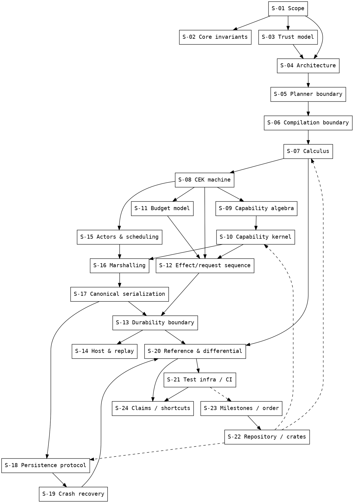

# 04 — Dependency Graph

Three layers: **A. section dependencies** (specification structure), **B. semantic-object dependencies** (what must exist before what, per the frozen architecture), **C. verification dependencies** (what evidence depends on what).

## A. Section dependency graph

```
S-01 Scope
 │
 ├── S-02 Core invariants ────────────────────────────────┐
 ├── S-03 Trust model                                      │ (normative for all)
 │     │                                                   │
 ├── S-04 Architecture ────────────────────────────────────┤
 │     ├── S-05 Planner boundary ──→ S-06 Compilation      │
 │     │                               │                   │
 │     │              S-07 Calculus ←──┘                   │
 │     │                  │                                │
 │     │      S-08 CEK machine ────────────────────────────┤
 │     │        │          │                               │
 │     │        │   S-09 Capability algebra                │
 │     │        │        │                                 │
 │     │        │   S-10 Capability kernel                 │
 │     │        │        │                                 │
 │     │   S-11 Budget model ─┘                            │
 │     │              │                                    │
 │     │      S-12 Effect model & request sequence         │
 │     │        │          │                               │
 │     │        │   S-13 Durability boundary ──────────────┤
 │     │        │        │                                 │
 │     │        │   S-14 Host & replay                     │
 │     │        │                                           │
 │     │   S-15 Actors & scheduling ──→ S-16 Marshalling   │
 │     │                                        │          │
 │     │              S-17 Canonical serialization (15A)   │
 │     │                      │                        │
 │     │              S-18 Persistence protocol (15B) ─────┤
 │     │                      │                        │
 │     │              S-19 Crash recovery ──────────────────┤
 │     │                                                    │
 ├── S-20 Reference model & differential ←──────────────────┤
 │     │                                                    │
 └── S-21 Test infra / mutation / CI ←──────────────────────┘
       │
 S-22 Repository structure (hosted by all)
 S-23 Milestones & order (sequences S-22 units)
 S-24 Claims & prohibited shortcuts (normative over S-20/S-21 results)
```

Notes:
- **S-05 → S-06**: planner proposals become `Block` only after staleness validation, then enter compilation.
- **S-08 depends on S-07**; **S-12 depends on S-08 + S-10 + S-11** (the request sequence gates on CEK evaluation, kernel authorization, and budget checks).
- **S-13 depends on S-17** (the durable `Prepared`/`Issued` records are 15A-canonical payloads inside 15B frames).
- **S-19 depends on S-18 + S-17** (recovery decodes 15A bytes via 15B framing).
- **S-20 is independent of production implementation** (R-REF-02) but depends on the *frozen semantics* of S-07…S-19.
- **S-21 depends on S-20** (mutation testing and coverage are defined against the differential oracle).

## B. Semantic-object dependency graph (frozen, from source L9059–9097, extended with 15A/15B)

```
Canonical encoding (15A)                     Semantic domains (Capability Algebra v0.2)
        │                                          │
        │                                          ▼
        │                                   CapabilityKernel
        │                                   (authority, revocation, derive, authorize)
        │                                          │
        │                    ┌─────────────────────┼──────────────────┐
        │                    ▼                     ▼                  ▼
        │             Effect / EffectCost   ExecutablePlan     (Budget algebra —
        │             (cost model)          (compiler artifact)  Consumable/Reserved/
        │                    │               ▲                   Deadline, checked ops)
        │                    │               │                        │
        │                    │        Block ─┘ (parse→normalize→       │
        │                    │         validate→lower→                 │
        │                    │         capability→resource)            │
        │                    ▼                     │                   │
        │             ActorState (EvalState, heap, budget, caps, mailbox)
        │                    │                     ▲
        │                    ▼                     │
        └────────────── GlobalState (t, ID allocators, runnable, event log, scheduler)
                              │
                              ▼
                        Scheduler (FIFO, 1 transition/turn)
                              │
        ┌─────────────────────┼──────────────────────┐
        ▼                     ▼                      ▼
  Effect issuance      Marshalling/          HostExecutor /
  (Prepared→Issued,    delegation            ReplayHost
   durable boundary)   (CapRef rejection)    (only issued effects)
        │
        ▼
  WAL / Snapshot / Effect journal (15B) → Recovery (independent)
```

**Cycle check:** no circular dependencies detected among frozen objects. The only cross-cutting pair (kernel ↔ runtime) is one-directional at the API level: the runtime calls kernel APIs (`authorize`, `derive`, `validate`); the kernel never references runtime state (R-KERN-03, R-TRUST-03). Potential cycle risk flagged: `ror-core` hosting both `Expr`/`Value` and the canonical traits while `ror-runtime` needs canonical marshalling — the source resolves this by keeping traits in `ror-core` and implementations in `ror-runtime`/`ror-persistence` (R-REPO-02), which must be verified at implementation time.

## C. Verification dependency graph

```
Frozen semantics (S-07…S-19)
        │
        ├─────────────────────────────┐
        ▼                             ▼
Production implementation      Reference implementation (independent,
(crates ror-core…ror-agent)    zero shared core logic)
        │                             │
        └──────────┬──────────────────┘
                   ▼
      Normalized observations (terminal states, traces, digests,
      resource partitions, authority outcomes, faults, recovered state)
                   │
                   ▼
          Differential comparator (first divergence)
                   │
     ┌─────────────┼──────────────────┬─────────────────┐
     ▼             ▼                  ▼                 ▼
  Exhaustive     Property-based     Crash-injection   Mutation registry
  small-state    (seeded, layered)  (T0–T6)           (M001–M018, additive)
     │             │                  │                 │
     └─────────────┴────────┬──────────────────────────┘
                            ▼
              Evidence: conformance over tested state space
                            │
                            ▼
              Acceptance: R-TEST-11 (3 conjuncts) → M11
```

**Ordering constraint (frozen):** reference model + differential harness must exist *before* the production CEK grows (R-ORDER-03); mutation framework validates itself against the differential oracle (R-TEST-06); no CI stage may be skipped to satisfy timing (R-TEST-01).

## DOT (graphviz) — section graph


